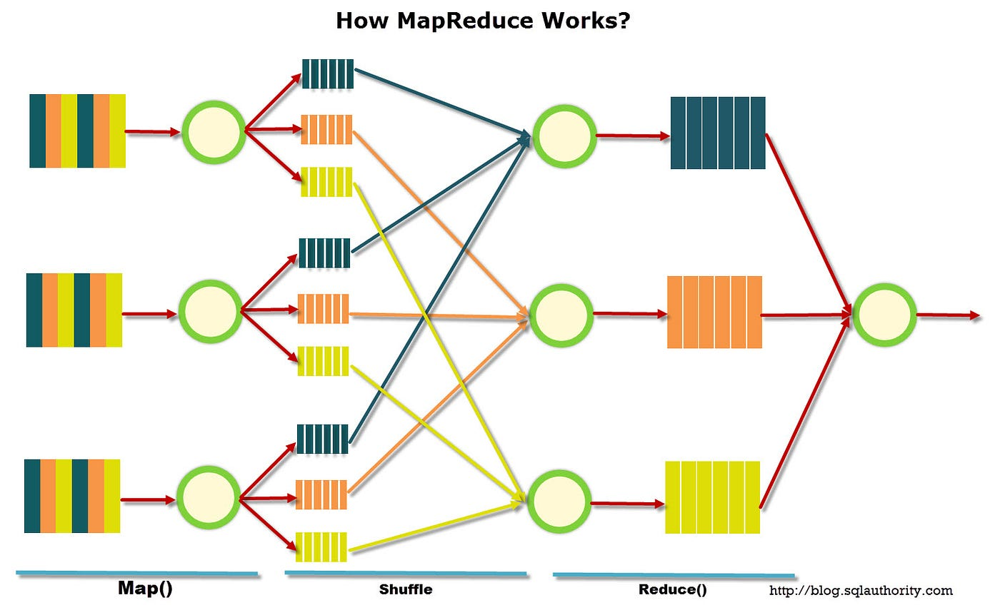

# Data-Mining-Map-Reduce

Python implementation of the Map Reduce framework for distributed word count in large text files

# Map Reduce

## Diagram




## Scheme

A master node called the Coordinator is in charge of:
* Split a text file into chunks.
* Launch two MapReduce distributed branches. 
* Launch the last Reducer to merge all the outputs into one sigle file.

Every branch is controlled by it's own BranchCoordinator who is in charge of:
* Assign chunks to the Mappers.
* Assign Map outputs to the Reducer.
* Restart failed Map and Reduce nodes.

## Folder Structure

All intermediate outputs are saved inside subdirectories:
* Files/Chunks
* Files/Map
* Files/Reduce

The final output is saved to Files/output.txt


## Fail Policy

The FailPolicy class defines the rate at which nodes fail. 

Steps to simulate node failures: 
* Every node (Mapper/Reducer) generates random failures.
* The BranchCoordinator monitors the status of the nodes.
* When a failure happens the BranchCoordinator restarts the node.


# How to Run

## File Generation
Run generate_file.py to generate a sample 250 MB input file, obtained by concatenating the bible.txt files multiple times.

```
python generate_file.py
```

## MapReduce TestDrive
To test the MapReduce scheme run:

```
python MapReduce.py
```